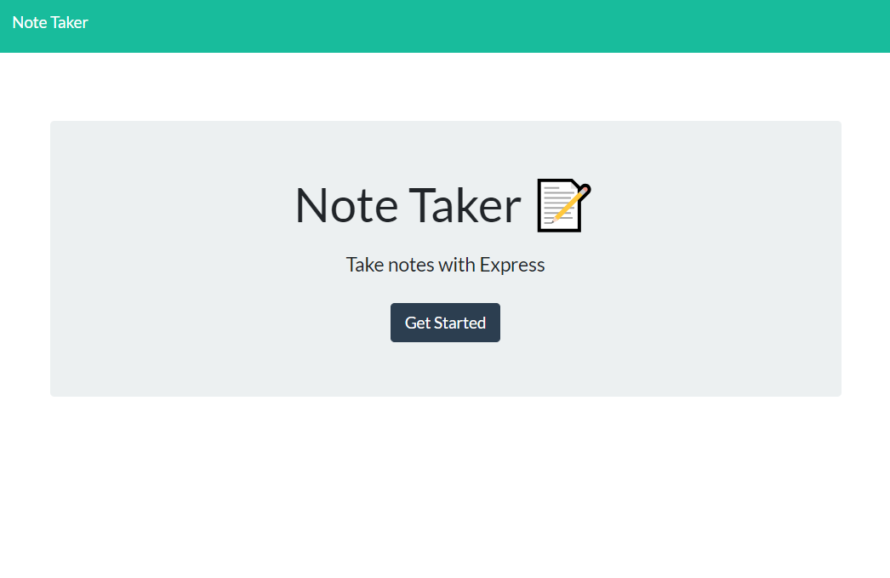
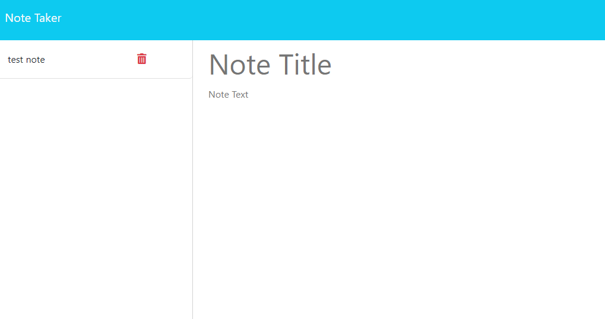

# Note Taker

## Description

The Note Taker application allows users to write, save, and delete notes. This application uses an Express.js back end to handle note data which is stored in a JSON file. The app is deployed on Heroku for easy access and usage.

## Table of Contents

- [Installation](#installation)
- [Usage](#usage)
- [API Routes](#api-routes)
- [Screenshots](#screenshots)
- [License](#license)
- [Contributing](#contributing)
- [Questions](#questions)

## Installation

To run the application locally, follow these steps:

1. Clone the repository:
# Note Taker

## Description

The Note Taker application allows users to write, save, and delete notes. This application uses an Express.js back end to handle note data which is stored in a JSON file. The app is deployed on Heroku for easy access and usage.

## Table of Contents

- [Installation](#installation)
- [Usage](#usage)
- [API Routes](#api-routes)
- [Screenshots](#screenshots)
- [License](#license)
- [Contributing](#contributing)
- [Questions](#questions)

## Installation

To run the application locally, follow these steps:

1. Clone the repository:
    ```bash
    git clone https://github.com/jahncalabrese/note-taker.git
    ```
2. Navigate to the project directory:
    ```bash
    cd note-taker
    ```
3. Install the necessary dependencies:
    ```bash
    npm install
    ```
4. Start the server:
    ```bash
    node server.js
    ```

The application will be available at `http://localhost:3001`.

## Usage

1. Open the application in your browser.
2. Click on the "Get Started" button to view and create notes.
3. Enter a note title and text, then click the save icon to save the note.
4. View saved notes in the left-hand column.
5. Click on a note in the left-hand column to view it in the main section.
6. Click the trash icon next to a note to delete it.

## API Routes

### HTML Routes

- `GET /notes` - Returns the `notes.html` file.
- `GET *` - Returns the `index.html` file for all other routes.

### API Routes

- `GET /api/notes` - Reads the `db.json` file and returns all saved notes as JSON.
- `POST /api/notes` - Receives a new note to save to the request body, adds it to the `db.json` file, and returns the new note to the client.
- `DELETE /api/notes/:id` - Deletes the note with the id equal to `req.params.id`.

## Screenshots




## License

This project is licensed under the MIT License.

## Contributing

Contributions are welcome! If you have any ideas, suggestions, or issues, feel free to submit a pull request or open an issue.

## Questions

If you have any questions, please contact me at:

- GitHub: [your-username](https://github.com/jahncalabrese)
- Heroku: https://note-taker-john-9567e78609be.herokuapp.com/
